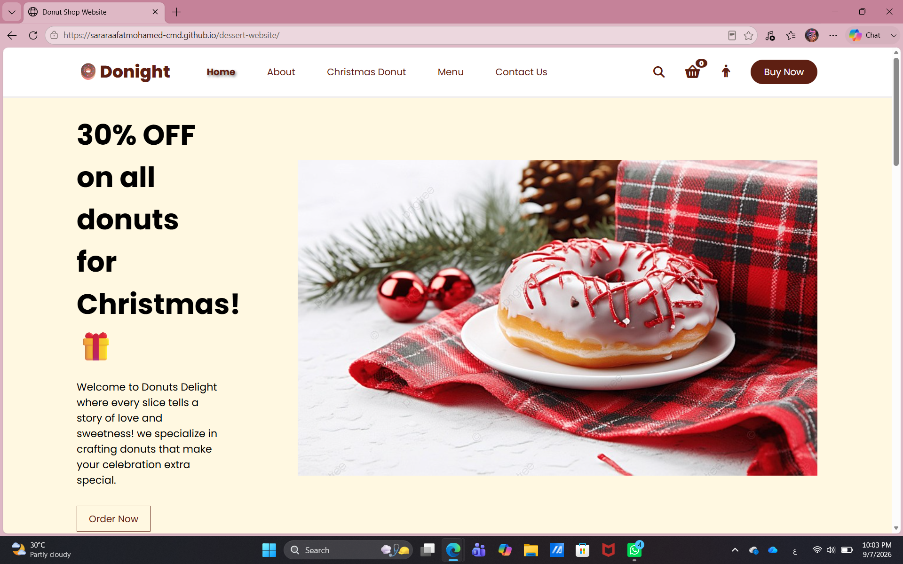
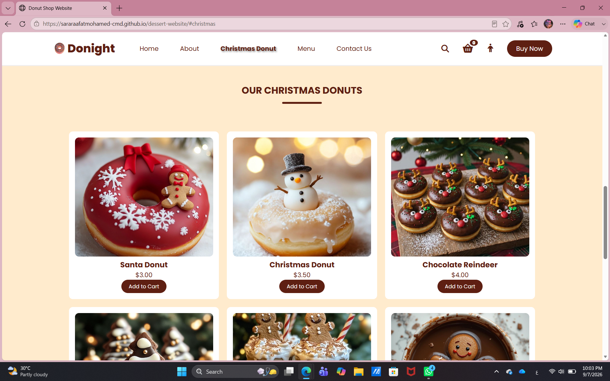
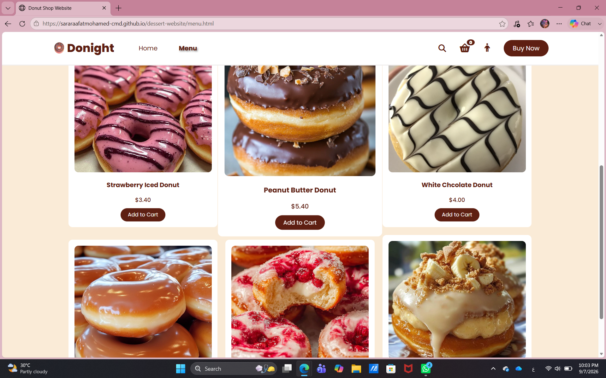
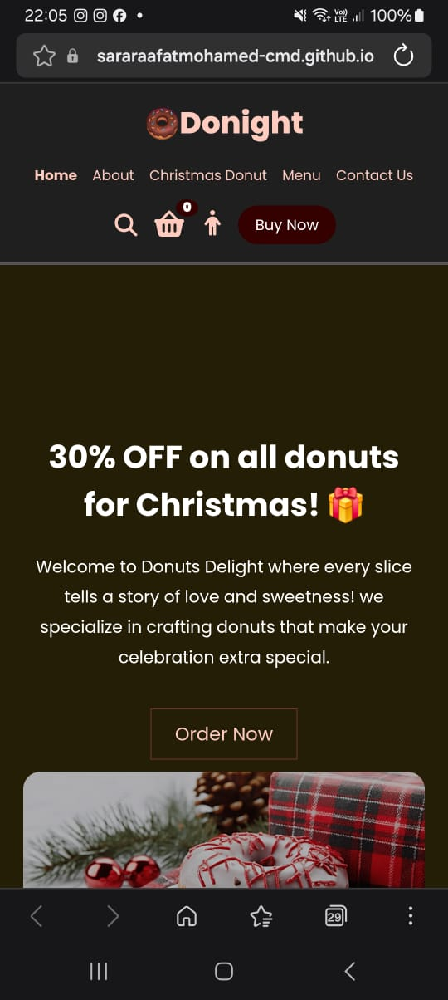
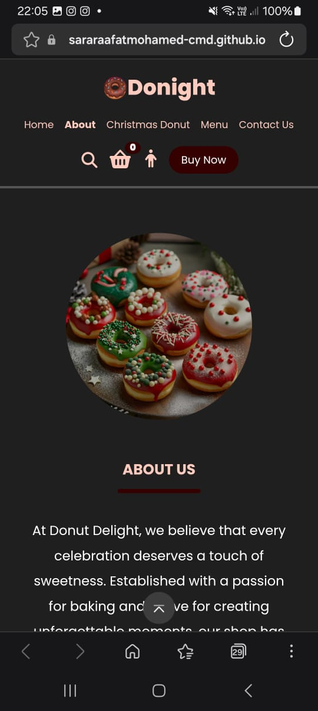

# 🍩 Donight — Donut Shop Website

A responsive and visually appealing donut shop website built as a front-end web development project using **HTML, CSS, and JavaScript**.

The website provides a simple and interactive experience for browsing donuts, exploring different sections, and adding products to a shopping cart.

---

## ✨ Features

- 🏠 **Home Page** with a promotional hero section
- 🍩 **Donut Menu** displaying available products and prices
- 🎄 **Christmas Donuts** special section
- 🛒 **Add to Cart** functionality with a persistent cart counter
- 🔍 **Search Interface**
- 👤 **Sign Up Page**
- 🔐 **Login Page**
- 📩 **Contact Us** section with a contact form
- 📱 **Responsive Design** for desktop, tablet, and mobile screens
- 🎨 Clean and modern UI with a donut-themed design

---

## 📸 Screenshots

### 💻 Desktop








### 📱 Mobile





---

## 🛠️ Technologies Used

- **HTML5** — Website structure and pages
- **CSS3** — Styling, layout, animations, and responsive design
- **JavaScript** — Interactivity and cart functionality
- **Font Awesome** — Icons
- **Google Fonts** — Poppins font
- **LocalStorage** — Saving the cart item count

---

## 📂 Project Structure

```text
dessert-website/
│
├── index.html
├── menu.html
├── login.html
├── signup.html
├── style.css
├── script.js
│
├── imgs/
│   └── ... website images
│
└── screenshots/
    ├── Home2.png
    ├── Christmas_Donut.png
    ├── Menu.png
    ├── Siggn_up.png
    ├── home.jpeg
    └── About_Us.jpeg
